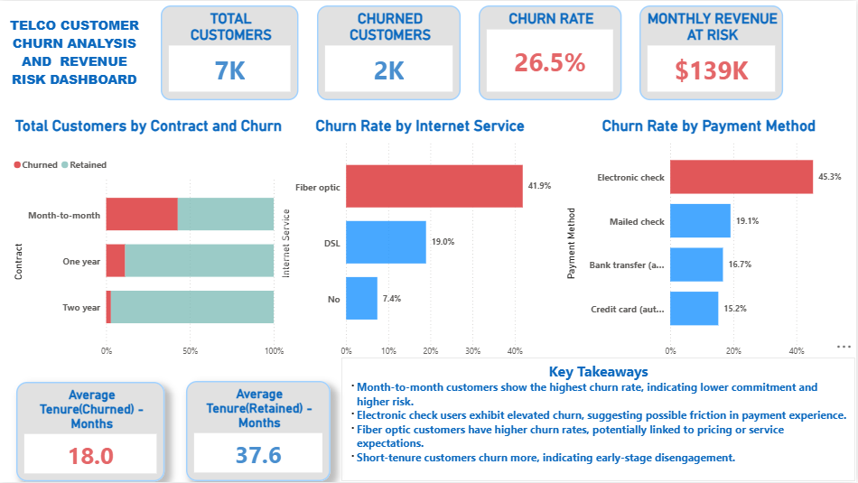
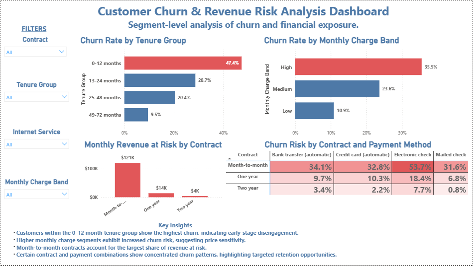

# Telco Customer Churn & Revenue Risk Analysis Dashboard

## 📊 Overview
This project analyzes customer churn behavior in a telecom company using Power BI.  
The objective is to identify key drivers of churn and quantify revenue at risk to support data-driven retention strategies.

---

## 🧰 Tools & Skills
- Power BI  
- Power Query (Data Cleaning & Transformation)  
- DAX (Measures & Calculations)  
- Data Visualization & Storytelling  

---

## 📈 Key Insights
- Month-to-month contracts show significantly higher churn rates.
- Customers using electronic check exhibit the highest churn levels.
- Fiber optic users churn more compared to other service types.
- Customers with shorter tenure (0–12 months) are more likely to churn.
- High monthly charge segments show increased churn risk.
- Significant revenue is concentrated in high-risk customer segments.

---

## 📊 Dashboard Features
- Interactive KPI cards (Total Customers, Churn Rate, Revenue at Risk)
- Churn driver analysis (contract, internet service, payment method)
- Customer segmentation (tenure group, monthly charges)
- Revenue risk analysis
- Matrix visualization highlighting high-risk combinations

---

## 📸 Dashboard Preview

### Executive Overview

### Customer & Revenue Risk Analysis

---

## 🎯 Business Value
This dashboard provides actionable insights that can help telecom companies:
- Improve customer retention strategies
- Identify high-risk customer segments
- Reduce revenue loss due to churn
- Optimize pricing and service offerings
